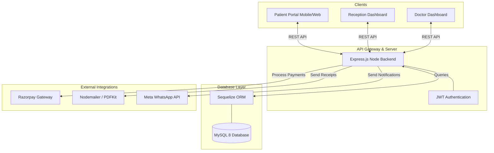

<div align="center">
  
  <h1 align="center">ClinicOS</h1>
  <p align="center">
    <strong>A next-generation, real-time Clinic Management & Patient Engagement Platform.</strong>
  </p>

  <p align="center">
    <a href="#features">Features</a> •
    <a href="#tech-stack">Tech Stack</a> •
    <a href="#getting-started">Getting Started</a> •
    <a href="#environment-variables">Environment Variables</a> •
    <a href="#api-reference">API Overview</a>
  </p>
</div>

---

## 🚀 Overview

**ClinicOS** streamlines daily healthcare operations by connecting Reception, Doctors, and Patients in real-time. From managing digital walk-in queues and detailed electronic medical records (EMRs) to facilitating seamless online payments and automated WhatsApp/Email receipts—ClinicOS handles it all in a beautiful, highly responsive interface.

---

## ✨ Key Features

### 👩‍⚕️ For Doctors
- **Live Patient Queue:** See exactly who is waiting outside in real-time.
- **Digital Consultations:** Record vitals, complaints, diagnoses, and instantly generate digital prescriptions.
- **Visit History:** Look up any patient's entire medical history and past vitals in seconds.
- **One-Click Actions:** Complete consultations and send patients straight to billing or the lab with a single tap.

### 🛎️ For Reception & Staff
- **Lightning Fast Lookup:** Search returning patients by phone number in milliseconds.
- **Smart Queuing System:** Issue active tokens, pause the queue, or jump emergencies to the front of the line seamlessly.
- **Comprehensive Billing:** Quickly auto-generate bills for consultations and lab tests with dynamic tax and discount calculations.
- **Cash & Online Support:** Track cash payments or trigger online payment requests.

### 🏥 For Patients (Patient Portal)
- **Live Queue Tracking:** Patients can check their live queue status from their phones—no more crowding the waiting room.
- **Account Linking:** Accounts are automatically created and linked to the phone number given at the clinic.
- **Online Bill Payment:** Fully integrated Razorpay gateway for UPI, Card, and Netbanking.
- **Automated Delivery:** Instant beautifully-styled PDF receipts and prescriptions sent via Email and WhatsApp (Meta Cloud API/MSG91).

---

## 🛠 Tech Stack

### Frontend (Client)
- **Framework:** [React 18](https://react.dev/) + [Vite](https://vitejs.dev/)
- **Styling:** [Tailwind CSS](https://tailwindcss.com/)
- **Routing:** React Router v6
- **Icons:** Lucide React
- **State/HTTP:** Axios

### Backend (Server)
- **Runtime:** [Node.js](https://nodejs.org/)
- **Framework:** [Express.js](https://expressjs.com/)
- **Database:** [MySQL 8](https://www.mysql.com/)
- **ORM:** [Sequelize](https://sequelize.org/)
- **Authentication:** JSON Web Tokens (JWT) + bcryptjs
- **Integrations:** Razorpay (Payments), Nodemailer + PDFKit (Email Receipts), WhatsApp Cloud API

---

## 💻 Getting Started

### Prerequisites
Before you begin, ensure you have the following installed:
- **Node.js** (v18 or higher)
- **MySQL Server** (running locally or via Docker)

### 1. Clone & Install
Clone the repository and install dependencies for both the frontend and backend.

```bash
# Install Backend dependencies
cd clinicOS-Backend
npm install

# Install Frontend dependencies (in a separate terminal)
cd ../clinicOS-Frontend
npm install
```

### 2. Configure Database & Environment
Create a `.env` file in the `clinicOS-Backend` directory based on the reference below, and ensure you have created an empty MySQL database named `clinicos`.

Create a `.env` file in the `clinicOS-Frontend` directory for your client-side variables (like your Razorpay publishable key).

### 3. Run the Application

**Start the Backend (Port 5000):**
```bash
cd clinicOS-Backend
npm run dev
```
*(The backend utilizes Sequelize `alter: { drop: false }` to automatically generate all required SQL tables on the first run).*

**Start the Frontend (Port 5173):**
```bash
cd clinicOS-Frontend
npm run dev
```

---

## 🔐 Environment Variables

### Backend (`clinicOS-Backend/.env`)
```env
# Application
PORT=5000
NODE_ENV=development
CLIENT_URL=http://localhost:5173

# Database (MySQL)
DB_HOST=localhost
DB_USER=root
DB_PASS=your_mysql_password
DB_NAME=clinicos

# Security
JWT_SECRET=your_super_secret_jwt_signature_key

# Payment Gateway (Razorpay)
RAZORPAY_KEY_ID=rzp_test_yourkeyid
RAZORPAY_KEY_SECRET=your_razorpay_secret

# Communications
MAIL_HOST=smtp.gmail.com
MAIL_PORT=587
MAIL_USER=your_email@gmail.com
MAIL_PASS=your_app_password
MAIL_FROM="ClinicOS <your_email@gmail.com>"

WHATSAPP_API_KEY=your_meta_cloud_token
WHATSAPP_PHONE_ID=your_whatsapp_phone_number_id
```

### Frontend (`clinicOS-Frontend/.env`)
```env
VITE_API_URL=http://localhost:5000/api
VITE_RAZORPAY_KEY_ID=rzp_test_yourkeyid
```

---

## 📬 Communication & Notifications Flow
ClinicOS implements a centralized robust messaging service (`message.service.js`). 
Whenever a bill is fully paid:
1. `pdfKit` generates a formatted A4 invoice in a memory buffer.
2. The `sendMessage` router resolves the patient's authenticated email (or fallback walk-in email).
3. The PDF is attached and dispatched via `nodemailer`, alongside a potential WhatsApp template ping using the Meta Cloud API.

---

## 🏗 System Architecture

ClinicOS is built on a modern decoupled architecture ensuring high performance and scalability.



### Monorepo File Structure

The project is divided into an independent React frontend and a Node.js backend to ensure separation of concerns and scalability.

**Frontend Container (`clinicOS-Frontend/src/`)**
```text
src/
 ├── assets/        # Static assets like images and global CSS
 ├── components/    # Reusable UI components (Buttons, Modals, Forms)
 ├── context/       # React Context providers for global state
 ├── hooks/         # Custom React hooks for shared logic
 ├── layouts/       # Shell layouts (Dashboard, Auth, etc)
 ├── pages/         # Route-level components (Reception, Doctor, Admin)
 └── services/      # Axios API definitions and endpoints
```

**Backend API (`clinicOS-Backend/src/`)**
```text
src/
 ├── config/        # Environment bindings, database credentials
 ├── controllers/   # Request handlers mapping routes to logic
 ├── middleware/    # Auth guards, rate limiting, error handling
 ├── models/        # Sequelize ORM schema definitions
 ├── routes/        # Express REST endpoint definitions
 ├── services/      # Core business logic (Payments, Messaging)
 └── utils/         # Helper functions (PDF generators, hashers)
```

---

## 📚 Comprehensive Documentation

For deep technical dives, database diagrams, and product requirements, please refer to the files located in the `Documents/` directory at the root of this project:

- 📄 **[ClinicOS_PRD.pdf](./Documents/ClinicOS_PRD.pdf):** The master Product Requirements Document detailing user stories and functional specs.
- 🎨 **[ClinicOS_Design_Document.html](./Documents/ClinicOS_Design_Document.html):** UI/UX breakdown and component design standards.
- 🗄️ **[ClinicOS_Data_Dictionary.docx](./Documents/ClinicOS_Data_Dictionary.docx):** Complete entity-relationship maps and database schema definitions.
- 🧰 **[ClinicOS_TechStack.pdf](./Documents/ClinicOS_TechStack.pdf):** Technical architectural decisions and library justifications.
- ✅ **[ClinicOS_Checklist.md](./Documents/ClinicOS_Checklist.md):** Tracked progress of launch implementation steps.

---

> Designed & Built for the future of Clinic Management.
